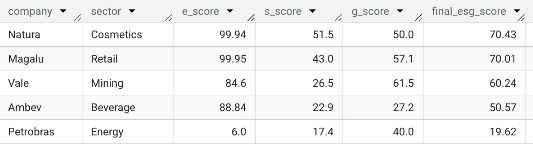

# esg-scoring-model
Quantitative ESG scoring model for corporate performance analysis

# Corporate ESG Scoring Model

## :pushpin: Project Objective
This project develops a quantitative model to evaluate and rank companies based on ESG (Environmental, Social, and Governance) criteria. The goal is to transform raw sustainability data into a comparative score (0-100) to support investment decisions and risk analysis.

## :hammer_and_wrench: Technologies & Tools
- **Data Logic:** SQL (Analytics Engineering approach)
- **Domain:** ESG & FinOps
- **Methodology:** Weighted Average with Variable Normalization

## :bar_chart: Calculation Methodology
To ensure a fair comparison across different industries, the model applies the following weights:
- **Environmental (40%):** Focused on $CO_2$ emissions (inverse scale).
- **Social (30%):** Based on internal diversity indices.
- **Governance (30%):** Assessment of board independence.

## :rocket: How to View the Analysis
Data transformation scripts are located in the /analysis folder. They demonstrate the cleaning of raw data found in /data and the application of business logic to generate the final ranking.

## :chart_with_upwards_trend: Business Insights
Through this model, it is possible to identify not only the top performers but also which sectors present higher governance risks or diversity gaps, enabling predictive analysis of regulatory compliance.

## :chart_with_upwards_trend: Model Results
After executing the Analytics Engineering logic (SQL), the final company ranking was consolidated.

**Analysis of Results::**
* **Natura & Magalu:** Lead the ranking due to low operational emissions (Scope 1 and 2) relative to their size, combined with solid governance indicators.
* **Vale & Ambev:** Show intermediate scores, reflecting the environmental challenges inherent in heavy industry and mining sectors.
* **Petrobras:** Holds the lowest score due to a high absolute volume of emissions (47M $tCO_2$), which heavily impacts the Environmental (E) pillar in the current normalization model.

> *Note: The weights used were 40% Environmental, 30% Social, and 30% Governance.*

